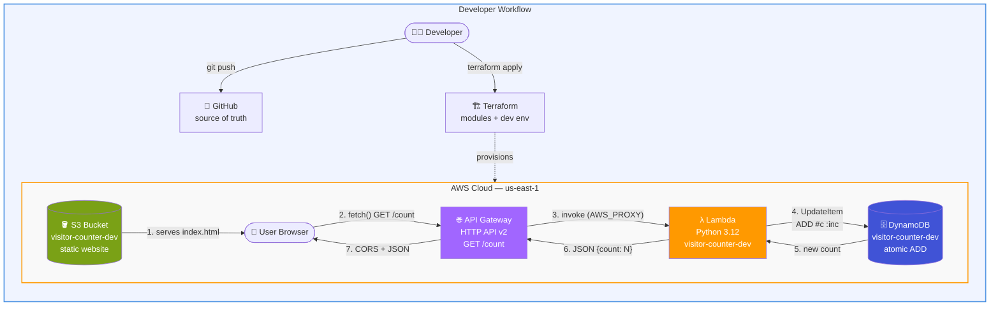
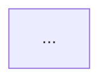

# Visitor Counter — Serverless on AWS

A production-pattern serverless application built with Terraform and Python.
Live visitor counter that increments on every page load.

## Architecture
Browser → S3 (static site) → API Gateway → Lambda (Python) → DynamoDB


## Architecture



**Why Mermaid wins:**
- ✅ Renders on GitHub instantly — no image files
- ✅ Edit-as-text — if architecture changes, update the diagram
- ✅ Version-controlled alongside the code (a reviewer sees the diagram in Git history)
- ✅ Future-proof — no "where did I save the PNG" problem

**Preview it:** Paste the same block into https://mermaid.live to see how it renders before pushing.

---

## 🥈 Option 2: Excalidraw (Best-looking for Portfolio)

Excalidraw gives you that hand-drawn, "I know what I'm doing" aesthetic that's trending in tech portfolios.

**Steps:**

1. Go to **https://excalidraw.com**
2. Click **Library** (book icon in top-left) → search "AWS" → add an AWS icon pack
3. Drag these into the canvas:

```
   ┌─────────┐       ┌──────────┐       ┌─────────┐       ┌──────────┐
   │  User   │──────▶│    S3    │       │   API   │──────▶│  Lambda  │
   │ Browser │       │ (static) │       │ Gateway │       │ (Python) │
   └─────────┘       └──────────┘       └─────────┘       └──────────┘
        │                                    ▲                 │
        │                                    │                 ▼
        │           ┌────────────────────────┘          ┌──────────┐
        └──────────▶│  fetch GET /count                │ DynamoDB │
                    └──────────────────────────────────│ counter  │
                                                       └──────────┘
```

4. Add arrows with labels: `serves HTML`, `fetch()`, `AWS_PROXY`, `atomic ADD`
5. Group the AWS services inside a big rounded rectangle labeled **"AWS Cloud"**
6. Optional: add a separate box for **Terraform** with a dashed arrow labeled `provisions`
7. **Export → PNG** → save to `docs/architecture.png` in your project

```bash
mkdir -p ~/visitor-counter/docs
# Move the downloaded PNG there
mv ~/Downloads/architecture.png ~/visitor-counter/docs/
```

Then reference it in the README:

```markdown

```

**Why Excalidraw wins:**
- ✅ Screenshots look great on a personal site / LinkedIn
- ✅ More visually striking than Mermaid
- ✅ Custom arrows that show request flow clearly
- ⚠️ But it's just an image — doesn't auto-update

---

## 🥉 Option 3: draw.io (Most Professional)

**https://app.diagrams.net** — has the official AWS icon set (accurate logos, service colors).

**Steps:**

1. Open draw.io → **New Diagram → Blank**
2. Click **More Shapes** (bottom-left) → check ✅ **AWS 19** (or latest)
3. Drag services from the AWS panel on the left:
   - **S3** (Storage)
   - **API Gateway** (App Integration)
   - **Lambda** (Compute)
   - **DynamoDB** (Database)
   - **CloudWatch** (Management & Governance) — optional
4. Group them inside a **"AWS Cloud"** container (also in the AWS panel)
5. Add arrows with labels showing the request flow
6. **File → Export as → PNG** → save to `docs/architecture.png`

**Why draw.io wins:**
- ✅ Uses the **official AWS service icons** — looks authoritative
- ✅ Used by real architecture teams
- ⚠️ Takes more time; less "designed" looking than Excalidraw

---

## 🎯 My Recommendation: Do BOTH Mermaid + Excalidraw

**Step 1:** Add the Mermaid block to your README → commit → push. Takes 2 minutes, GitHub renders it immediately. Now anyone visiting your repo sees the architecture.

**Step 2:** Spend 5 minutes in Excalidraw making a prettier version → export PNG → save as `docs/architecture.png` → embed at the top of the README.

**Result:**

```markdown
# Visitor Counter — Serverless on AWS


## Request Flow



## Tech Stack
...
```

Now you have:
- 📸 **A pretty hero image** for LinkedIn / portfolio sites (Excalidraw PNG)
- 🔄 **A live, always-up-to-date diagram** rendered by GitHub (Mermaid)
- 📂 **A docs folder** that shows you care about documentation

---

## 🚀 Let's Do It

**Run these commands:**

```bash
cd ~/visitor-counter

# Create docs folder
mkdir -p docs

# Open README so you can paste the Mermaid block
code README.md
```

**Paste the Mermaid block** where the current `![Architecture]...` line is, then:

```bash
git add .
git commit -m "Add Mermaid architecture diagram to README"
git push
```

**Open GitHub:** https://github.com/Olufemooshegs/aws-serverless-visitor-counter

You should see the diagram render directly on the repo page. 🎉

---

## 🎨 One More Option — ASCII (Nerdiest, but Cool)

If you want to go full-terminal aesthetic in the README, here's an ASCII version:

```
                    ┌─────────────────────────────────────────┐
                    │           AWS CLOUD (us-east-1)         │
                    │                                         │
   ┌──────┐         │  ┌──────┐       ┌──────────┐            │
   │ User │────1────┼─▶│  S3  │       │   API    │            │
   │ 🌐   │◀───2────┼──│ 🌐   │       │ Gateway  │            │
   └──┬───┘         │  └──────┘       │  /count  │            │
      │             │                 └────┬─────┘            │
      │  3. fetch() │                      │ 4. invoke        │
      └─────────────┼──────────────────────┘                  │
                    │                      │                  │
                    │                      ▼                  │
                    │              ┌─────────────┐            │
                    │              │   Lambda    │            │
                    │              │   Python    │            │
                    │              └──────┬──────┘            │
                    │                     │ 5. ADD            │
                    │                     ▼                   │
                    │              ┌─────────────┐            │
                    │              │  DynamoDB   │            │
                    │              │  counter    │            │
                    │              └─────────────┘            │
                    └─────────────────────────────────────────┘

                       Deployed with Terraform ✨
```

Some developers love this aesthetic. Your call. 😄

---

**Which one do you want to go with?** Or do all three — Mermaid for the README, Excalidraw for LinkedIn, ASCII for the fun of it? 🚀

## Tech Stack

| Layer | Technology |
|---|---|
| Infrastructure as Code | Terraform (≥ 1.5) |
| Cloud provider | AWS (us-east-1) |
| Compute | AWS Lambda (Python 3.12) |
| API | API Gateway (HTTP API v2) |
| Storage | DynamoDB (on-demand) |
| Static hosting | Amazon S3 |
| State backend | S3 + DynamoDB lock |

## Features

- ✅ **Atomic counter** — `ADD` operation in DynamoDB, safe under concurrency
- ✅ **Remote state** — S3 backend with versioning, encryption, and DynamoDB locking
- ✅ **Least-privilege IAM** — Lambda can only touch its own table, only the operations it needs
- ✅ **Modular Terraform** — 4 reusable modules (dynamodb, lambda, api_gateway, s3_website)
- ✅ **CORS** — configured at both API Gateway and Lambda response level
- ✅ **Structured logging** — Lambda logs to CloudWatch with 7-day retention
- ✅ **Fully automated** — one command to deploy, one to tear down

## Project Structure
.
├── terraform/
│ ├── bootstrap/ # Run once — creates S3 + DynamoDB for state
│ ├── modules/ # Reusable building blocks
│ │ ├── dynamodb/
│ │ ├── lambda/
│ │ ├── api_gateway/
│ │ └── s3_website/
│ └── environments/
│ └── dev/ # Dev environment consuming all modules
├── lambda/src/index.py # Python Lambda function
└── frontend/index.html # Static site


## Prerequisites

- AWS account with an IAM user (programmatic access)
- Terraform ≥ 1.5
- AWS CLI v2 configured (`aws configure`)
- Python 3.12 (for local Lambda syntax checks)

## Deployment

### 1. Bootstrap the Terraform backend (run once)

```bash
cd terraform/bootstrap
terraform init
terraform apply
Note the two outputs — you'll need them in the next step.

2. Configure the dev environment
Edit terraform/environments/dev/backend.tf and set the bucket/table names
from the bootstrap outputs.

3. Deploy
cd terraform/environments/dev
terraform init
terraform plan
terraform apply

Terraform will print two URLs:

website_url — open this in a browser

api_url — the raw API endpoint

Testing
curl $(terraform output -raw api_url)
# → {"count": 42}

curl $(terraform output -raw api_url)
# → {"count": 43}
Cleanup
Order matters — destroy the environment first, then the bootstrap:
# 1. Destroy the app
cd terraform/environments/dev
terraform destroy

# 2. Destroy the backend (after removing prevent_destroy from bootstrap/main.tf)
cd terraform/bootstrap
terraform destroy
Design Decisions
HTTP API over REST API — 70% cheaper, lower latency, simpler CORS

On-demand DynamoDB — no capacity planning for unpredictable traffic

Atomic ADD operation — no race conditions under concurrent visitors

Remote state with locking — prevents corruption from concurrent applies

Separate bootstrap — solves the "Terraform can't manage its own backend" problem

Least-privilege IAM — Lambda only has UpdateItem and GetItem on one table

What I Learned
Bootstrapping Terraform state backends

Designing reusable Terraform modules with clear input/output contracts

Serverless patterns on AWS (Lambda + API Gateway + DynamoDB)

CORS in a cross-origin serverless architecture

Least-privilege IAM policy design
License
MIT
